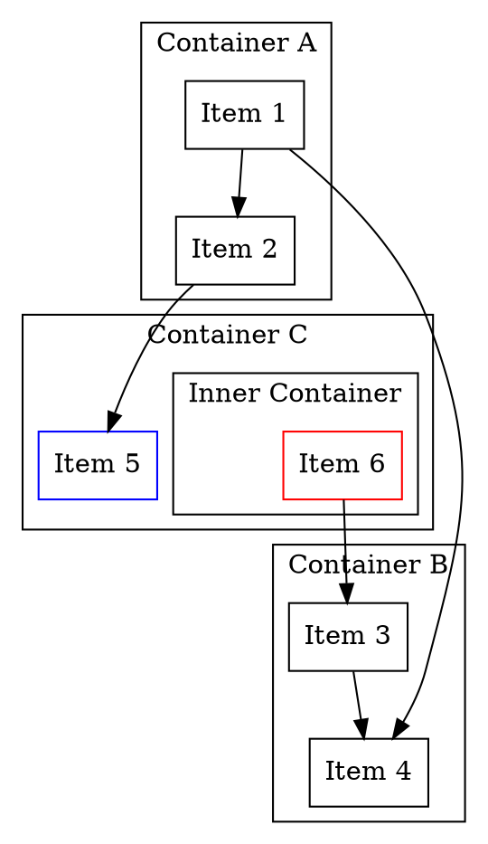
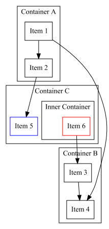

# Compose Dot

Experimental proof of concept to generate GraphViz dot code via Jetpack Compose's tree management.
Valid `dot` file content can be generated simply by provided `@Composable` functions like `SubGraph` or `Cluster` etc.

## Usage

For example, usage in Kotlin as follows.

```kotlin
DirectedGraph("Hello") {
    node {
        "shape" `=` "rectangle"
    }
    Cluster("Container A") {
        "Item 1" link "Item 2"
    }
    Cluster("Container B") {
        "Item 3" link "Item 4"
    }
    Cluster("Container C") {
        "Item 5" {
            "color" `=` "blue"
        }
        Cluster("Inner Container") {
            "Item 6" {
                "color" `=` "red"
            }
        }
    }
    "Item 1" link "Item 4"
    "Item 2" link "Item 5"
    "Item 6" link "Item 3"
}
```

Will generate the following `.dot` source code.



Visualized via `dot` command



## Further reading

* [Jetpack Compose for Non UI - Tree construction and source code generation](https://arunkumar.dev/jetpack-compose-for-non-ui-tree-construction-and-code-generation/)

## Motivation

* Dot file generation was initially implemented using standard Kotlin API for https://github.com/arunkumar9t2/scabbard


## License

    Copyright 2021 Arunkumar

    Licensed under the Apache License, Version 2.0 (the "License");
    you may not use this file except in compliance with the License.
    You may obtain a copy of the License at

        http://www.apache.org/licenses/LICENSE-2.0

    Unless required by applicable law or agreed to in writing, software
    distributed under the License is distributed on an "AS IS" BASIS,
    WITHOUT WARRANTIES OR CONDITIONS OF ANY KIND, either express or implied.
    See the License for the specific language governing permissions and
    limitations under the License.

